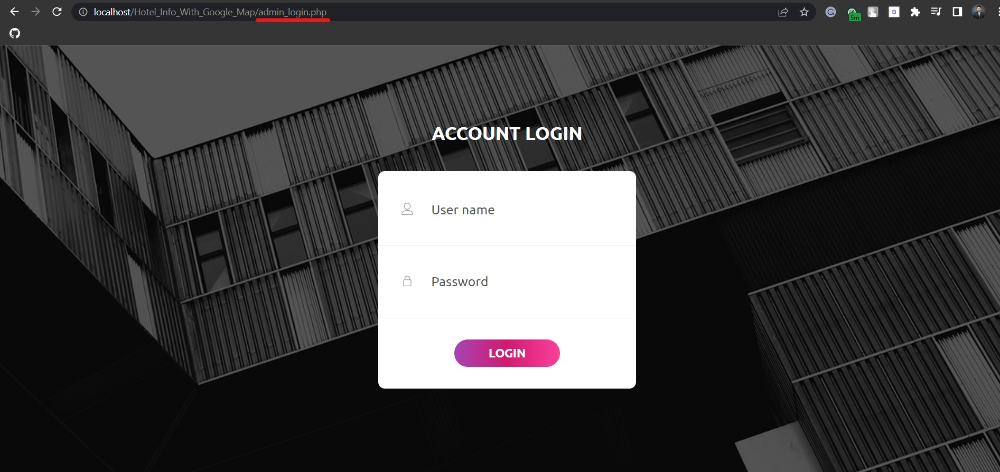

# Find Your Hotel

## Introduction


This project aims to provide a web-based platform to search and find a suitable hotel and restaurant in Sri Lanka, this web portal contains a lot of hotels information those data can be entered using its backend panel. We can filter out hotels and restaurants based on district and division.


## Technology and Frameworks

### Frontend

- HTML 5
- CSS 3
- JavaScript
- jQuery
- Bootstrap 4

### Backend
- PHP
- MySQL


## Directory Structure

- **0-database** : Contains the database of the system.
- **1-soruce**   : Contains source code of the project.
- **2-selenium-testing-scripts**   : Contains testing scripts for the project.

- **github-readme-contents**   : Contains GitHub readme assets.


## Configuration & Setup

**Step 01:** The source code is found on the "1-source" directory, deploy it in a server.

**Step 02:** The database is found on the "0-database" folder, deploy it in a MySQL database engine Ex: phpMyAdmin.

## System Explained

### Website Index Page

This is the front page of the website. It contains some basic information of the online platform.


### Search Page

This page has a filter feature where visitors are able to search and find information of hotels and restaurants in Sri Lanka, the search could used to filter restaurants and hotels based on districts.


### Admin Page

```
http://www.domain-name.com/admin_login.php

```

**Note:** The admin page is hidden, in order to open the admin panel, we have to type **"/admin_login.php"** after the domain name of this platform, an example is shown bellow.

### Admin Login



#### Credentials

- **Username:** guna
- **Password:** kuna123


### Admin Account

This is the admin panel. It contain six modules such as Dashboard, Register Hotels, modify hotels, Cerate Gallery, Preview, Settings, Logout.

- **Dashboard:** Has a simple UI.
- **Register Hotels:** has the function to register hotels.
- **Modify Hotels:** has delete/edit function.
- **Cerate Gallery:** has function to create gallery for registered hotels.
- **Preview:** has function to preview hotel info as visitors.
- **Settings:** has function to change credentials such as password.
- **Logout:** has function to logout. 


### Admin Account Settings

This is the admin setting page. This page contains all information about the admin, here there are options to change password, username, theme, profile pictures, etc.


### Admin Profile Change

By clicking the change profile picture button on the setting page, it will be redirected to this page. Here, we can change the profile picture, it has a slider to adjust the profile picture size. If we click the browse button, that will let us select a profile picture from the local computer to upload.


### Admin Theme Change


### Change Password

- Go to settings


### Change Username

- Go to settings


### Student Registration Module

This module is the registration module which is used to register students to the system. Here, the admin will enter the student details to add into the system. the admin needs to enter the following basic information such as name, date of birth, age, contact info and etc.

#### Features
- Insert students in a precise manner.

- This modules uses AJAX call to retrieve the course and batch details from the database to show to admin to select which course that the student is going to follow.

- This module has the functionalities to calculate the age of the student with the given date of birth.


### Student Management Module

#### Features
- This module is used to update the student details.
- This module is used to delete the student details.


### Staff Registration Module

This module is used to register staff details to the system.

#### Features
- This module is used to store the staff details  in the database.

- This module uses AJAX calls to gather department information from the database to assign to the corresponding staff.

- This module automatically calculate the age of the staff with the given date of birth.


### Staff Management Module

#### Features
- This module is used to manage the staff details.
- Store staff derails into database.
- Update staff details.
- Delete staff details.


### Add Course Module

#### Features
- Add courses to the database


### Manage Course Module

#### Features

- Course can be deleted
- Course can be updated


### Add Batch Module

#### Features
- Add batches to the database.


### Manage Batch Module

#### Features

- Batches can be deleted


### Add Department Module

#### Features
- Add department data to the database.


### Manage Department Module

#### Features

- Department data can be deleted


### Add Module (Subjects) Section

#### Features
- Add modules to the database.


### Manage Module (Subjects) Section

#### Features

- This module has the CRUD functionalities.
- This module has the ability to list down subjects based on courses.  


### Add Results Module

#### Features
- It is used to insert results in database.

- It uses AJAX to retrieve batch number from the database when we select course

- When we select course, it will list down all the batch numbers which corresponds to a specified course.

- When we select batch number it will list all the students who are in that selected batch number.


### Manage Results Module

#### Features

- This module can be used to show the results.

- When we select the course, it will list all the batch numbers which are associated with it.

- When we select the batch number, it will list down all students who are in that particular batch.

- When we click search it will list down the results of the student.


### Results (Search Output)

#### Features

- After selecting student and click the show results button, it will bring up that particular student results in a separate page.

- Results can be deleted.

- Results can be updated.

- If we click back button, it will go back to the search panel.


### Create Student Accounts Module

#### Features

- This module is used to create user accounts for students.

- This module uses AJAX.


### Manage Student Accounts Module

#### Features

- This module is used to perform CRUD functions in user accounts such as change student password, username and etc.

- Students account can be deleted.
- Student account details can be updated.


### Student Account Login

#### Sample Student login

- **Username:** student1
- **Password:** pass123


### Student Account

The user accounts are used by the students to show their results. It would be very useful for them to maintain their work in a perfect manner. The users do not have much permissions. They only have some basic operations that they can used to perform.


#### Features

- They can view their results.
- They can change their profile picture
- They can change their password
- They can change the theme of the website.


### Results (Student Account)

#### Features

- They can view their results.


### Change Student Account Theme


### Change Profile Picture Student Account


### Change Password Student Account


## Web Testing Scripts Explained

### Introduction

Web testing is a software testing practice to test websites or web applications for potential bugs. It’s a complete testing of web-based applications before making them live.

**Note:** The testing script for this web application is found on the following directory "2-selenium-testing-scripts/start-testing.py", to start the automatic testing run this scripts.

**Note:** The framework, selenium is used to build this testing script with python Programming language.

#### Setup Testing Script

- **Step 01: Install Python**
  - [Download Python](https://www.python.org/)

- **Step 02: Install Selenium**
  - ```pip install selenium```

- **Step 03: Download Latest Driver for Chrome**
  - [Download Chrome Driver](https://chromedriver.chromium.org/downloadsrg/)

- **Step 03: Install Pynput**
  - ```pip install pynput```


#### Execute Testing script.

- **Step 01:** The script is found on the following directory.

  ```
  ebcas/2-selenium-testing-scripts/start-testing.py
  ```

- **Step 02:** Edit the URL to the domain (Hosted URL) on line number 32.

  

- **Step 03:** Execute the script.

  ```
  python start-testing.py
  ```

#### Testing script output.


## Social Media Links

* [Linkedin Profile](https://www.linkedin.com/in/gunarakulangunaretnam/)
* [Facebook Page](https://www.facebook.com/gunarakulangunaretnam)
* [Twitter Profile](https://twitter.com/gunarakulan)
* [Instagram Profile](https://www.instagram.com/gunarakulangunaretnam/)
* [Youtube Channel](https://www.youtube.com/channel/UCMWkED5sabgVZSCKjZuRJXA)
